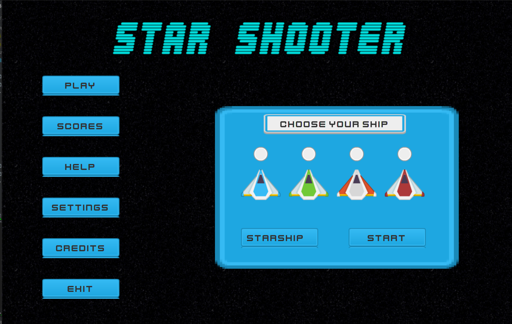

<div align='center'>
  
</div>

# RUN TIME COMPONENTS:
```
--module-path /Users/bharathrouthu/Downloads/javafx-sdk-15.0.1/lib --add-modules javafx.controls,javafx.media,javafx.fxml
```
# JAVAFX LIBRARY

```
JAVAFX-SDK-15.0.1
```
